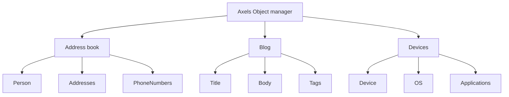

## Why

I started with a project with an abstract database class. For objects I extend a base class that offers all CRUD functions and more. So I don't need to handle with sql in my custom objects. 

But this is is a non visual class.

This project offers now a web interface. 

## What it can do

An application is a pre defined set of its objects. Axels object manager can handle multiple applications.

When using basic authentication or SSO you can use access rules per application for admins/ editors/ viewers/ no access.
