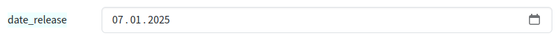

## Input type date

Input fields of type date will be used when the property starts with "date".
Please set `'create' => 'date'` too.

### Screenshot



### Snippet

```php
        'date_release' => [
            'create' => 'date', 
            'overview'=>1,
        ],

```

### Remarks

The visualization of the date will be done by the browser. The date format in the input field depends on the browser language of the visitor.
