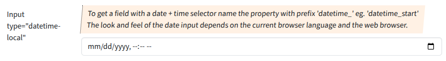

## Input type "month"

Input fields of type **month** will be used when the property starts with "month_".
Please set `'create' => 'date'` too.

### Screenshot



### Snippet

```php
        // ----- <input type="datetime-local">
        'datetime_start' => [
            'create' => 'date', 
            'overview'=>false,
            'markup-pre' => '<hr><br>',
            'attr' => [
                'label' => 'Input type="datetime-local"',
                'hint' => 'To get a field with a date + time selector name the property with prefix \'datetime_\' eg. \'datetime_start\'<br>
                    The look and feel of the date input depends on the current browser language and the web browser.
                ',
            ],
        ],
```

### Remarks

The visualization of the date will be done by the browser. The date format in the input field depends on the browser language of the visitor.
