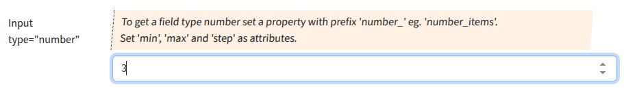

## Input type "number"

Input fields of type **number** will be used when the property starts with "number".

### Screenshot



### Snippet

```php
        // ----- <input type="number">
        'number_items' => [
            'create' => 'int', 
            'overview'=>false,
            'markup-pre' => '<hr><br>',
            'attr' => [
                'label' => 'Input type="number"',
                'hint' => 'To get a field type number set a property with prefix \'number_\' eg. \'number_items\'.<br>
                    Set \'min\', \'max\' and \'step\' as attributes.',
                'min' => 0,
                'max' => 10,
                // 'placeholder' => 'user@example.com',
            ],
        ],
```
