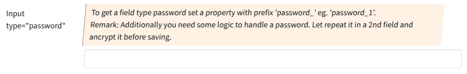

## Input type "password"

Input fields of type **password** will be used when the property starts with "password".

### Screenshot



### Snippet

```php
        // ----- <input type="password">
        'password_1' => [
            'create' => 'varchar(128)', 
            'overview'=>false,
            'markup-pre' => '<hr><br>',
            'attr' => [
                'label' => 'Input type="password"',
                'hint' => 'To get a field type password set a property with prefix \'password_\' eg. \'password_1\'.<br>
                    Remark: Additionally you need some logic to handle a password. Let repeat it in a 2nd field and ancrypt it before saving.',
            ],
        ],
```
