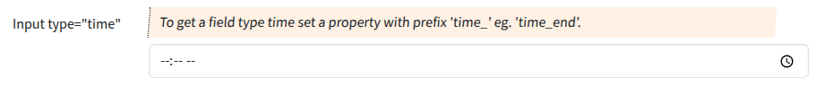

## Input type "time"

Input fields of type **time** will be used when the property starts with "time".
Please set `'create' => 'date'` too.

### Screenshot



### Snippet

```php
        // ----- <input type="time">
        'time_end' => [
            'create' => 'date', 
            'overview'=>false,
            'markup-pre' => '<hr><br>',
            'attr' => [
                'label' => 'Input type="time"',
                'hint' => 'To get a field type time set a property with prefix \'time_\' eg. \'time_end\'.',
                // 'placeholder' => 'user@example.com',
            ],
        ],
```
