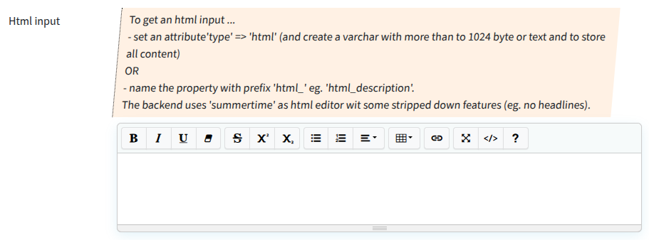

## Textarea - HTML

WYSIWYG editor for multiline input area.

### Screenshot



### Snippet

```php
        // ----- html input
        'description_html' => [
            'create' => 'varchar(2048)',
            'validate_is'=>'string', 
            'attr' => [
                'label' => 'Html input',
                // 'required' => 1,
                'type' => 'html',
                'hint' => 'To get an html input ...<br>
                    - set an attribute\'type\' => \'html\' (and create a varchar with more than to 1024 byte or text and to store all content)<br>OR<br>
                    - name the property with prefix \'html_\' eg. \'html_description\'.<br>
                    The backend uses \'summertime\' as html editor wit some stripped down features (eg. no headlines).
                    ',
                'placeholder' => 'Type something here...',
            ],
        ],
```
