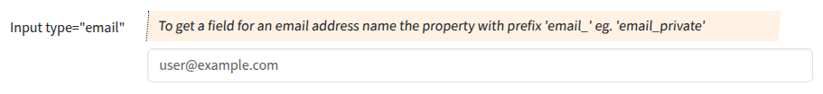

## Input type "email"

Input fields of type **email** will be used when the property starts with "email".

### Screenshot



### Snippet

```php
        // ----- <input type="email">
        'email_private' => [
            'create' => 'varchar(64)', 
            'overview'=>false,
            'markup-pre' => '<hr><br>',
            'attr' => [
                'label' => 'Input type="email"',
                'hint' => 'To get a field for an email address name the property with prefix \'email_\' eg. \'email_private\'',
                'placeholder' => 'user@example.com',
            ],
        ],
```
