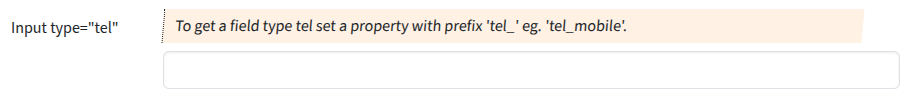

## Input type "tel"

Input fields of type **tel** will be used when the property starts with "tel".

### Screenshot



### Snippet

```php
        // ----- <input type="tel">
        'tel_mobile' => [
            'create' => 'varchar(32)', 
            'overview'=>false,
            'markup-pre' => '<hr><br>',
            'attr' => [
                'label' => 'Input type="tel"',
                'hint' => 'To get a field type tel set a property with prefix \'tel_\' eg. \'tel_mobile\'.'
                // 'placeholder' => 'user@example.com',
            ],
        ],
```
