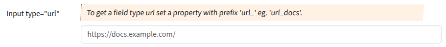

## Input type "url"

Input fields of type **url** will be used when the property starts with "url".

### Screenshot



### Snippet

```php
        // ----- <input type="url">
        'url_docs' => [
            'create' => 'varchar(1024)', 
            'overview'=>false,
            'markup-pre' => '<hr><br>',
            'attr' => [
                'label' => 'Input type="url"',
                'hint' => 'To get a field type url set a property with prefix \'url_\' eg. \'url_docs\'.',
                'placeholder' => 'https://docs.example.com/',
            ],
        ],
```
