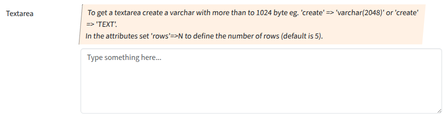

## Textarea

A textarea is a multi-line text input field. It will be rendered if varchar size is greater 1024 bytes or TEXT.

### Screenshot



### Snippet

```php
        // ----- <textarea>
        'description_text' => [
            'create' => 'varchar(2048)',
            'validate_is'=>'string', 
            'attr' => [
                'label' => 'Textarea',
                // 'required' => 1,
                'hint' => 'To get a textarea create a varchar with more than to 1024 byte eg. \'create\' => \'varchar(2048)\' or \'create\' => \'TEXT\'.<br>
                    In the attributes set \'rows\'=>N to define the number of rows (default is 5).
                    ',
                'placeholder' => 'Type something here...',
                'rows' => 3,
            ],
        ],

```
