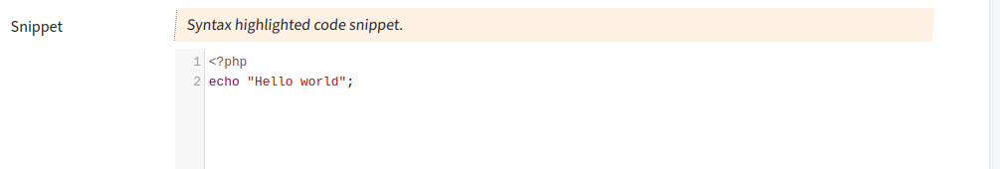

## Textarea - Codemirror

Syntax highlighted editor for multiline input area.
This feature uses Codemirror in the background.

### Screenshot



### Snippet 1

To activate it set the attribute "type" with prefix "highlight-" followed by a type of syntax highlighting.

```php
        // ----- html input
        'snippet' => [
            'create' => 'text', 
            'validate_is'=>'string', 
            'attr'=>[
                'label' => 'Snippet',
                'tag'=>'textarea', 
                'type'=> 'highlight-text', // define syntax highlighting
            ],
        ],
```

TODO: list highlighting types

### Snippet 2

You can set custom attributes for codemirror. They have the prefix "cm-".

| Key              | type     | default   | description |
| ---              | ---      | ---       | --- |
| cm_height        | {string} | -         | css value for height
| cm_theme         | {string} | "default" | codemirror theme
| cm_readonly      | {bool}   | false     | input is writable
| cm_linenumbers   | {bool}   | true      | show line numbers
| cm_linewrapping  | {bool}   | false     | enable line wrapping

### Snippet 3

To set a type by value of another attribute use a hook.

```php
        // ----- html input
        'snippet' => [
            'create' => 'text', 
            'validate_is'=>'string', 
            'attr'=>[
                'label' => 'Snippet',
                'tag'=>'textarea', 
                'type'=> 'highlight-text',
                'rows' => 5,
                'hooks' => [
                    'type'=> 'hookGetSnippetType' // define a hook
                ],
            ],
        ],
```

... with a hook method of given name.
It refers to another attribute of the object that is a lookup of available types.

```php
    /**
     * Hook for column snippet
     * Get the current value of "programminglang" and return it to hihghlight
     * the code window using codemirror
     * @return string
     */
    public function hookGetSnippetType(): string{
        $sReturn="text";
        if($this->id()){
            $aRel=$this->relReadLookupItem('programminglang');
            $sReturn = (string) ($aRel['type']??"text");
        }
        return "highlight-$sReturn";
    }
```
