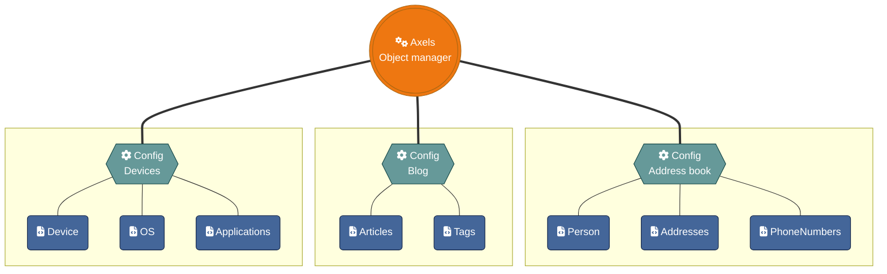

## Overview

Remember the structure?!

What we can (and or must) configure is:

* **1 configuration** for the ui
    * [admin/config/settings.php](10_settings.php.md) - Configure behaviour of the web ui and access rules for all apps  
* **Per application** there is its app folder. The foldername is the id of the application.

    * [apps/\<APPID\>/config/objects.php](20_application_config.md) - Configure an application here  

* In **each application configure its objects**

    * [apps/\<APPID\>/classes/\<OBJECT\>.class.php](30_Objects/_index.md) - Configure an object of an application  