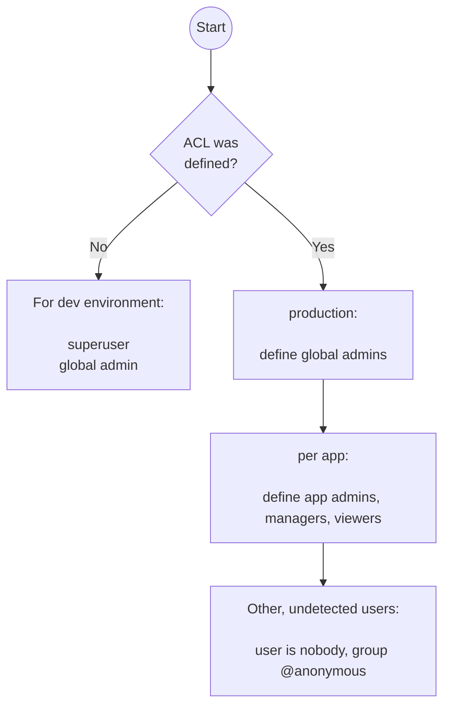

# admin acl rules

## Description

The file adminacl.class.php cotnains the class *adminacl*.
It is a helper class for the admin backend.

* detect a user in $_SERVER
* set groups based on configuration set
  * global admins can be defined - ist has admin access on each app backends
  * per application can be set to access a given application:
    * admin
    * manager
    * viewer

## Configuration

The acl is based on the config key "acl" - see config/settings.php.

Example:

```php
return [

    // ...

    // if "acl" is missing or empty --> sets admin user for everything
    'acl'=>[

        // ---------- USER
        // common field for basic authentication or shibboleth
        'userfield'=>'REMOTE_USER',
        
        // but maybe yoou want to use another field
        // 'userfield'=>'mail', // set by shibboleth authentication

        // 'displayname'=>['givenName', '_surname'],
        'displayname'=>false,

        // ---------- GROUPS
        'groups'=>[

            // ----- global admins for all apps
            'global'=>[
                'admin'=>[
                    'admin',
                    'axel',
                ],
            ],

            // ----- "myapp 1"
            'myapp1'=>[
                'admin'=>[],
                'manager'=>[
                    'bodo',
                ],
                'viewer'=>[
                    'anne',
                ],
                    
            ],

            // ----- "myapp 2"
            'myapp2'=>[
                'admin'=>[],
                'manager'=>[],
                'viewer'=>[],
            ],

        ],
];
```

## Rules to apply groups

* if no acl config is set (eg. rename the key "acl"): user is set to "superuser" and group "admin". Use this for your dev or single user environment.
* If no user is detected from the given userfield: it is set to "nobody" with group "@anonymous"
* If a user was detected 
  * the detected userid is set and it gets a group "@authenticated"
  * check for global admin
  * loop over appnames: detect [USERID] in 
    * "admin" (for app admin)
    * "manager" (for editors)
    * and other named groups (=read access).

The set groupname for apps has [APPID] + underscore as prefix, eg. "myapp1_manager".



## Methods

### Init

In index.php it is initialized where the user and its group will be detected.

Example:

```php
require_once('classes/adminacl.class.php');
$acl=new adminacl();

if ($acl->canView("myapp1")){
    die("You are not allowed to view data of [myapp1].");
}
```

### Get permission infos

To implement limited access:

* `isGlobalAdmin()` - check if the current user is global admin
* `isAppAdmin([APPID])` - check if the current user has admin permission for current app. Only admin users can
  * repair tables
  * backup / restore
* `canEdit([APPID])` - check if the user has "moderator" or admin permission
* `canView([APPID])` - check if the current user has "viewer" permission
* `is([GROUPNAME])` - check if a group explicitly was set

### Other getter

* `getuser()` - string - get detected user id
* `getUserDisplayname()` - string - get a readable name
* `getGroups()` - array - get a list of detected groups.

### Setter

* `setapp([APPID])` - set an appid - then you can call the getters for permission infos without app.
* `setuser([NEWUSER])` - switch user context; this is possible as global admin only
