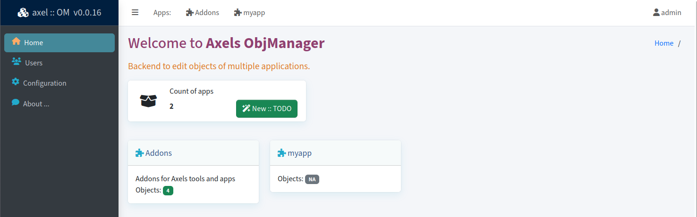
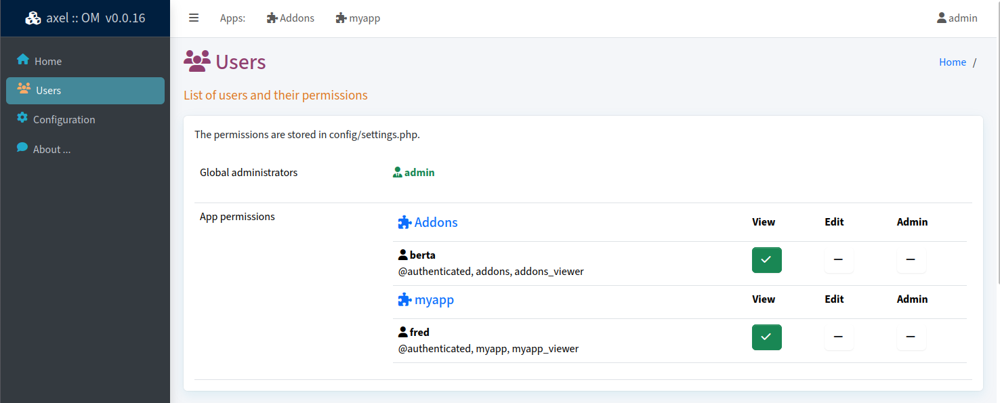

# Axels Object Manager

A web ui using AdminLTE for visual editing of objects for multiple apps.

📄 Source: <https://github.com/axelhahn/axelOM/> \
📜 License: GNU GPL 3.0 \
📗 Docs: TODO

- - -

I initiated my own abstracted class for databases. For developng an application with several tables that can be linked there is a repository https://github.com/axelhahn/php-abstract-dbo

This project offers a web ui to edit a single application or multiple applications that are using multiple php-abstract-dbo objects.

## Status

This project is work in progess.

## Requirements

* PHP 8
* PHP-PDO: sqlite (mysql will be supported soon)

## Features

* ui with multiple language support (en-en + de+de are delivered)
* CRUD actions for all objects of a given application
* file uploads
* link all objects using an extra table for relations between tables
* internal search to find objects
* detection of changed database definitions
* export as json + import can be used to switch between PDO database types
* enabled debugging shows execution time, GET/P OST and executed queries incl. their execution time and affected rows

## Screenshots

**Home** page: list all available apps.
On the left side is a global menu to see users and permissions and global configuration.

In the user management you can list all users and their permissions for each app.

After selecting an app on top you see the app specific objects. For each object you can list its entries and edit them.

## Related projects

* abstract database class: https://github.com/axelhahn/php-abstract-dbo
* AdminLTE-renderer: https://git-repo.iml.unibe.ch/iml-open-source/adminlte-renderer
