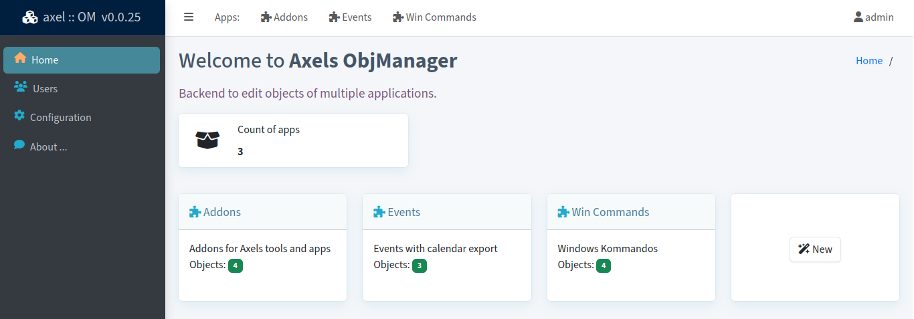
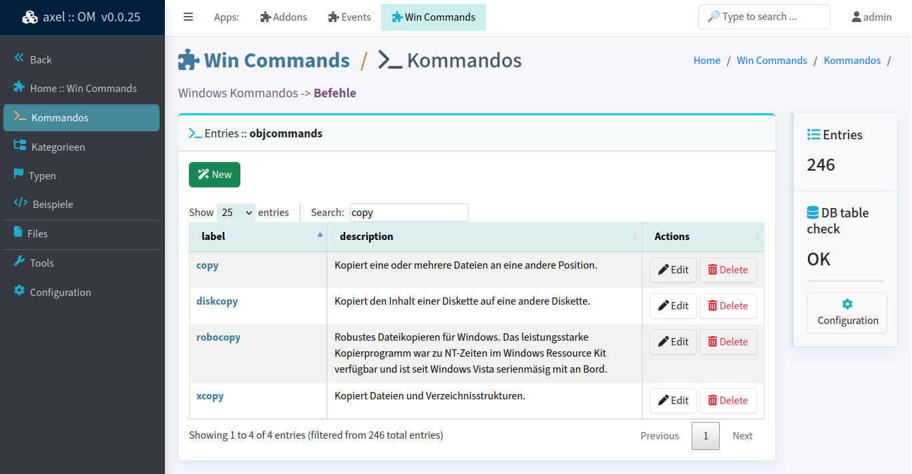

# Axels Object Manager

A web ui using AdminmLTE for visual editing of objects for multiple apps.

📄 Source: <https://github.com/axelhahn/axelOM/> \
📜 License: GNU GPL 3.0 \
📖 Docs: TODO

- - -

I initiated my own abstracted class for databases. For developng an application with several tables that can be linked there is a repository https://github.com/axelhahn/php-abstract-dbo

This project offers a web ui to edit a single application or multiple applications that are using multiple php-abstract-dbo objects.

## Status

This project is work in progess.

## Requirements

* PHP 8
* PHP-PDO: sqlite (mysql will be supported soon)

## Features

* ui with multiple language support (en-en + de+de are delivered)
* CRUD actions for all objects of a given application
* file uploads
* link all objects using an extra table for relations between tables
* internal search to find objects
* detection of changed database definitions
* export as json + import can be used to switch between PDO database types
* enabled debugging shows execution time, GET/P OST and executed queries incl. their execution time and affected rows

## Screenshots

Home page: list all available apps:

List all items of an object in a selected app to add / edit / delete entries:

## Related projects

* abstract database class: https://github.com/axelhahn/php-abstract-dbo
* AdminLTE-renderer: https://git-repo.iml.unibe.ch/iml-open-source/adminlte-renderer
